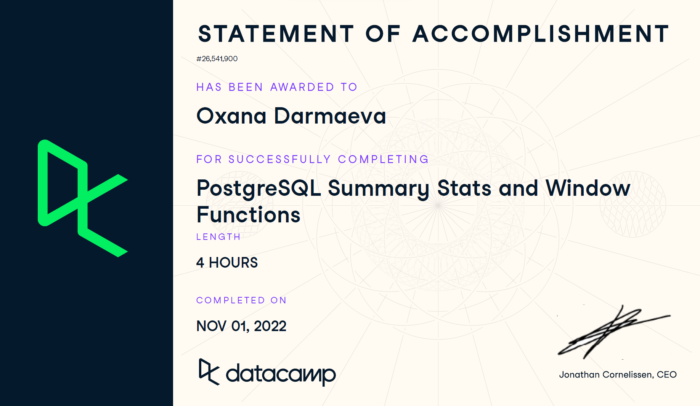

# Hi there 👋 
My name is Oxana (pronounced as Ak-sa-na). I am an aspiring data analyst with a background in research & economics and a passion for transforming raw data into actionable insights. Proficient in data analysis tools such as Python, SQL, and Tableau. Eager to collaborate on projects that leverage data to drive business decisions and solve complex problems. Check out my GitHub for a glimpse into my data analysis projects and coding skills!

# Languages and tools 🔧

# Contact me :incoming_envelope:
* [Telegram](https://t.me/oxanadarmaeva)
* [Email](mailto:oxana.darmaeva@outlook.com)

# Certifications :chart_with_upwards_trend:

Verify at: https://coursera.org/verify/professional-cert/WBCZXXST6AL5
<!--  -->

Verify at: https://www.datacamp.com/statement-of-accomplishment/track/3a4f9d690b9dd9b219c8d4166c8f9ad52def9b2a?raw=1
<!--  -->

Verify at: https://www.datacamp.com/statement-of-accomplishment/course/9779d4c60c9a55d43f3265ab2d47cc2ca459c09b?raw=1
<!--  -->

Verify at: https://www.datacamp.com/statement-of-accomplishment/course/5c965ce585b97243d772e2e96c853ebafa6a06c1?raw=1
<!--  -->

Verify at: https://lab.karpov.courses/certificate/5cd61cc5-7af3-43a5-97cf-e72a6084a6ad/en/

  

# My projects :point_down:
